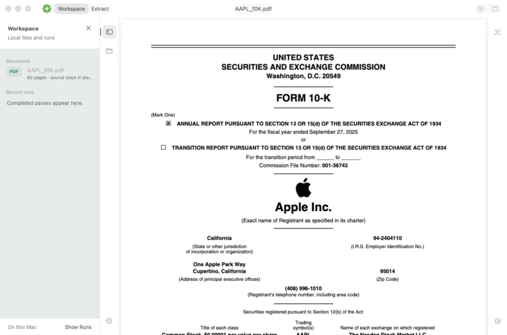
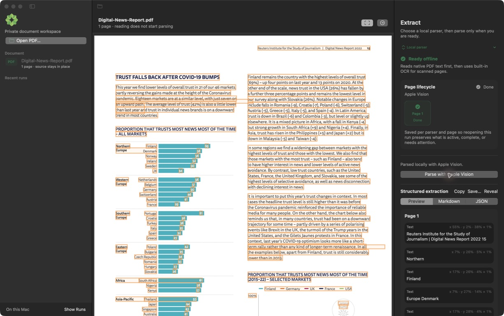
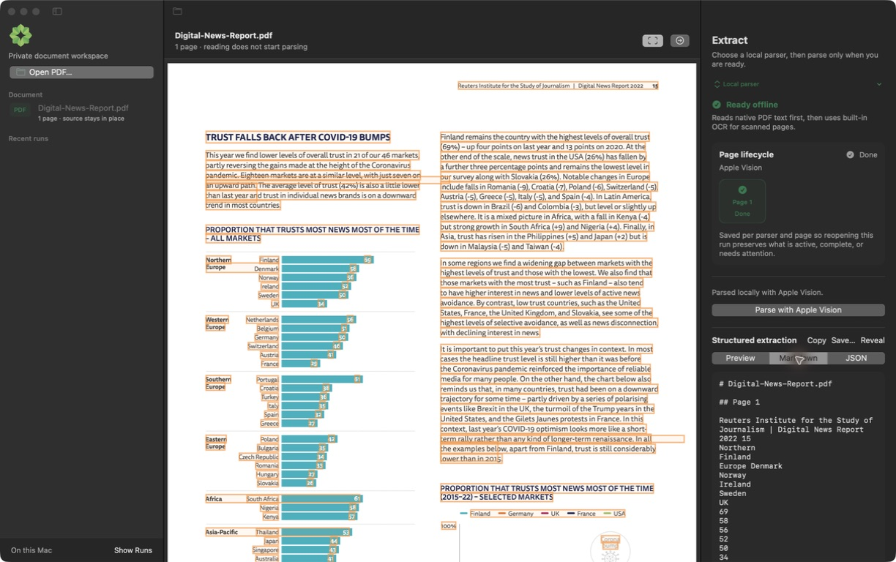
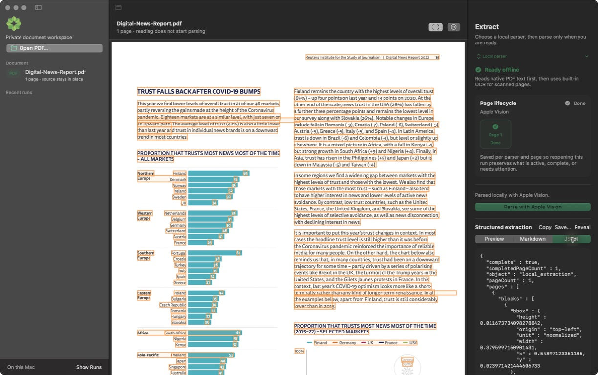

<p align="center">
  
</p>

<h1 align="center">okraPDF for macOS</h1>

<h3 align="center">Read and parse PDFs privately on your Mac</h3>

<p align="center">
  Open a PDF in place, read the original, and choose exactly when to turn it
  into structured local output. No account, document library, or cloud upload.
</p>

The next RC.4 candidate introduces a document-first workspace: the native
reader stays mounted in the center while compact rails and collapsible local
Workspace and Extract panels keep context close without permanently narrowing
the PDF.

<p align="center">
  <a href="https://github.com/okra-project/desktop/releases/tag/desktop-v1.0.0-rc.3">
    
  </a>
  <a href="https://github.com/okra-project/desktop/releases">
    
  </a>
  <a href="LICENSE">
    
  </a>
</p>

<p align="center">
  <a href="https://github.com/okra-project/desktop/releases/tag/desktop-v1.0.0-rc.3">Download</a> ·
  <a href="docs/releases/README.md">Release notes</a> ·
  <a href="https://github.com/okra-project/desktop/issues/new">Report an issue</a>
</p>



## Read first. Parse when you choose.

Opening a document never starts extraction. okraPDF keeps the source PDF where
it is, renders it with native PDFKit, and waits until you choose **Parse**.
The selected local parser then produces reviewable output beside a persistent
per-page run history on this Mac.

- Read text, charts, forms, and scanned pages in a native document-first workspace.
- Parse with built-in Apple Vision, an installed Ollama vision model, or the
  optional Baidu Unlimited-OCR setup.
- Inspect extracted blocks against their source boxes without modifying the PDF.
- Preview, copy, save, or reveal Markdown and JSON output.
- Cancel and resume long runs without throwing away completed pages.

<table>
  <tr>
    <td width="33%">
      
    </td>
    <td width="33%">
      
    </td>
    <td width="33%">
      
    </td>
  </tr>
  <tr>
    <td align="center">Source-aligned blocks you can inspect</td>
    <td align="center">Readable Markdown, ready to copy or save</td>
    <td align="center">Normalized JSON for downstream workflows</td>
  </tr>
</table>

## Private by design

1. **Your PDF stays put.** okraPDF reads the file you opened instead of copying
   it into an app-owned document library.
2. **Parsing is explicit.** Reading or replacing a document does not create a
   run; extraction starts only when you click **Parse**.
3. **Processing stays local.** Apple Vision and Baidu extraction run on the
   Mac. Ollama uses only its loopback service on this Mac.
4. **Artifacts stay inspectable.** Run state, page checkpoints, Markdown, and
   JSON live under `~/Library/Application Support/Okra/Runs/`.

Baidu Unlimited-OCR may download its pinned model once during setup. The app
verifies every model artifact with SHA-256 and forces extraction offline after
setup. Ollama remains responsible for installing and storing Ollama models.

## Local parsers

| Parser | Setup | Best fit |
| --- | --- | --- |
| **Apple Vision** | None; built into macOS | Zero-setup text and scanned PDFs |
| **Auto (Hybrid)** | Start Ollama and choose an installed vision model | Mixed PDFs; native text with page-level vision fallback |
| **Ollama** | Start Ollama and choose an installed vision model | Bring your own local vision model |
| **Baidu Unlimited-OCR** | Optional pinned 4-bit MLX model, about 2.4 GB | Experimental OCR and layout extraction on Apple silicon |

## Download

`desktop-v1.0.0-rc.3` is the current public release candidate for Apple-silicon
Macs running macOS 13 or later.

1. Download `Okra-1.0.0-rc.3.dmg` from the
   [v1.0.0-rc.3 release](https://github.com/okra-project/desktop/releases/tag/desktop-v1.0.0-rc.3).
2. Optionally download the adjacent checksum and run
   `shasum -a 256 -c Okra-1.0.0-rc.3.dmg.sha256`.
3. Open the DMG, drag **Okra** to **Applications**, and eject the DMG.
4. Open **Okra** from Applications. The app and DMG are Developer ID signed,
   hardened, notarized by Apple, and stapled for normal Gatekeeper opening.

The app checks its signed update feed daily. Choose **Check for Updates…** in
the app menu at any time, or install a newer DMG from
[GitHub Releases](https://github.com/okra-project/desktop/releases).

## Build from source

You need macOS 13 or later and Swift 5.9 or later.

```bash
git clone https://github.com/okra-project/desktop.git
cd desktop
swift build
```

To create a local `.app` and DMG:

```bash
./scripts/build-dmg.sh 1.0.0-rc.3
```

Local packages are ad-hoc signed. The release workflow supplies the Developer
ID identity, hardened runtime, notarization, and signed Sparkle appcast.

## Test

```bash
bash scripts/verify-brand-surface.sh
PYTHONDONTWRITEBYTECODE=1 python3 -m unittest discover -s scripts/tests -p '*_tests.py'
swift test
```

The test suite covers the read-before-parse contract, provider integration,
page checkpoints, cancel/resume recovery, structured output, source-box
geometry, packaging, and signed-update metadata.

## Project map

```text
OkraPDF/       SwiftUI app, PDFKit reader, and local parsing providers
Tests/         Product, provider, persistence, and packaging tests
scripts/       Verification, packaging, and release automation
docs/releases/ Versioned user-facing release notes
```

Maintainers should start with [CLAUDE.md](CLAUDE.md),
[RELEASE_CHECKLIST.md](RELEASE_CHECKLIST.md), and
[LAUNCH.md](LAUNCH.md). Historical changes are indexed in
[docs/releases](docs/releases/README.md).

## License

okraPDF Desktop is available under the [MIT License](LICENSE).
